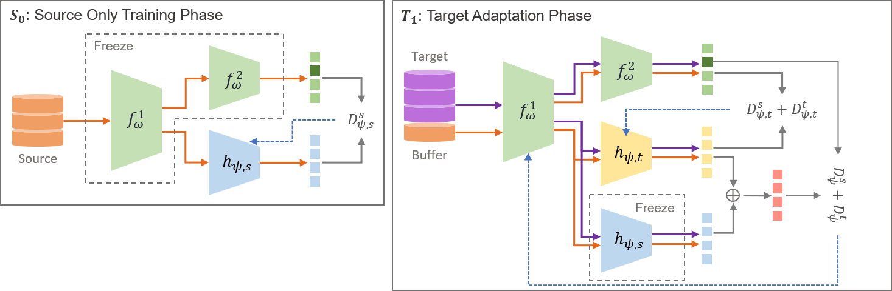

This repository contains the code accompanying the paper  "
Continual Domain Adversarial Adaptation via Double-Head Discriminators " Paper[link](https://arxiv.org/pdf/2110.08477.pdf): 



#### Requirements to run the code:
---

1. Python 3.8
2. Tensorflow 2.15.0
3. numpy 1.20.3
4. tqdm

#### Download dataset:
---

Download mnistm data:
```
curl -L -O http://www.eecs.berkeley.edu/Research/Projects/CS/vision/grouping/BSR/BSR_bsds500.tgz
```
Preprocess mnistm dataset
```
python create_mnistm.py 
```
